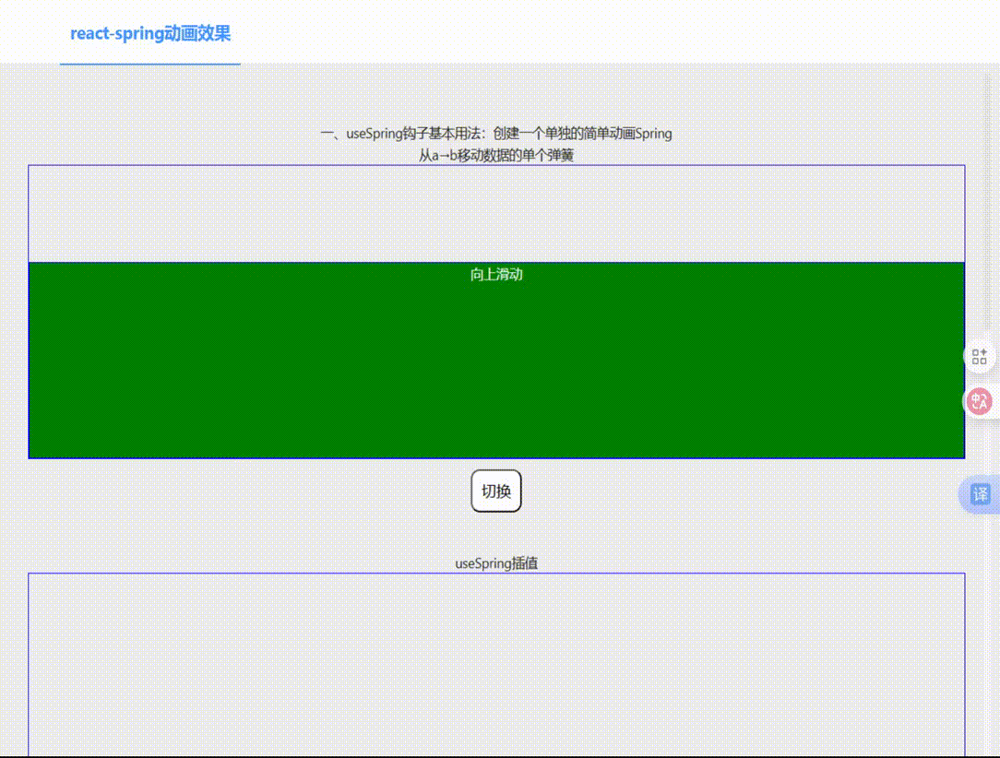

+++
date = '2025-09-09T16:34:41+08:00'
draft = false
title = 'React-Spring组件库介绍'

+++

### React-Spring动画库介绍

react官网中提到的动画库有3个：React Transition Group\React MOtion以及React-Spring.其中React-Spring动画库社区最活跃，代码更新频次最高，文档也较完善；

优势：react-spring是一个基于弹簧物理学的动画库，灵感来自animated和react-motion，它继承了animated库的插值和性能以及react-motion的易用性，react-spring库提供了两种api:hooks api(只能写在函数组件中，写在类组件中会报错);Render-props api。

性能：最核心的一点就是每次动画属性改变不会引起组件重新render,而是直接修改了dom上的相关属性。所以这个动画效果就更接近真实世界。

<span style="color:red">注意</span>，<u>在使用该库之前，要注意react-spring/web这个的版本，react18版本的项目适配于react-spring/web@9.7.3,之前没有指定版本导致下载下来的版本是10，在使用useTransition这个钩子的时候一直报</u>：

```
ncaught TypeError: Cannot add property ref, object is not extensible
```

1. #### Hook Api介绍

   - useSpring:创建一个单独的简单动画Spring(a-位置>b位置)的单独动画。

   - useSprings:就是创建多个不同动画。用于列表。

   - useTrail:创建一组依次执行的Spring-多个弹簧(相同)，一个弹簧在另一个弹簧之后。

   - useTransition:添加组件挂载或卸载等生命周期变化时的动画。

   - useChain:用于自定义spring执行顺序。

   - demo:

     ```js
     import "./styles.css";
     import React, { useState, useRef } from "react";
     import data from "./data";
     import {
       useSpring,
       useSprings,
       useTrail,
       useChain,
       useTransition,
       animated,
       useSpringRef
     } from "react-spring";
     
     export default function App() {
       return (
         <div className="App">
           <Spring1></Spring1>
           <Spring2></Spring2>
           <Springs></Springs>
           <Trails></Trails>
           <Chains></Chains>
         </div>
       );
     }
     export const Spring1 = () => {
       const [show, setShow] = useState(false);
       const spring = useSpring({
         from: {
           opacity: 0,
           // transform: 'translateY(0px)'
           y: 300 //v9新写法
           // rotateZ: 180,
         },
         to: {
           opacity: 1,
           // transform: 'translateY(200px)'
           y: 0
           // rotateZ: 0,
         },
         reverse: show,//设置动画移动的方向，为false就从from->to,反之相反。
         // native: false,
         // delay: 1000,
         config: {
           mass: 1, //弹簧质量：回弹惯性，质量越大惯性越大
           tension: 100 //弹簧张力：影响整体速度，张力越紧速度越快
           // friction: 5,//摩擦力：可以与mass、tension的效果相互抵消
         }
       });
       const spring1 = useSpring({
         //另一种写法
         opacity: show ? 1 : 0,
         transform: show ? "translateY(0px)" : "translateY(200px)"
       });
       return (
         <div className="wrapper">
           <h2>一、useSpring钩子基本用法：创建一个单独的简单动画Spring</h2>
           <h3>从a→b移动数据的单个弹簧</h3>
           <div className="box">
             <div className="flex1"></div>
             <animated.div className="box1" style={spring}>
               向上滑动
             </animated.div>
           </div>
           <button onClick={() => setShow((v) => !v)} className="mybtn">
             切换
           </button>
         </div>
       );
     };
     const Qwe = () => {
       return <div>1</div>;
     };
     export const Spring2 = () => {
       const [show, setShow] = useState(false);
       const spring = useSpring({
         from: {
           h: 40
         },
         to: {
           h: 200
         },
         reverse: show,
         // delay: 1000,
         config: {
           mass: 5 //弹簧质量：回弹惯性，质量越大惯性越大
           // tension: 300,//弹簧张力：影响整体速度，张力越紧速度越快
           // friction: 5,//摩擦力：可以与mass、tension的效果相互抵消
         }
       });
       const spring2 = useSpring({
         from: {
           height: "40px"
         },
         to: {
           height: "200px",
           backgroundColor: "blue"
         },
         reverse: show
         // delay: 1000,
       });
       return (
         <div className="wrapper">
           <h2>useSpring插值</h2>
           <div className="box">
             <div className="flex1"></div>
             <div
               style={{
                 display: "flex",
                 alignItems: "flex-end",
                 justifyContent: "center"
               }}
             >
               <animated.div
                 className="box2"
                 style={{
                   background: "yellow",
                   // height: spring.h.interpolate((height) => `${height}px`)
                   // height: spring.h.to((height) => `${height}px`) //v9 interpolate替换为to
                   height: spring.h.to({
                     range: [40, 100, 150, 200],
                     output: ["40px", "30px", "250px", "200px"]
                   }) //v9 interpolate替换为to
                 }}
               >
                 {/* <Qwe></Qwe> */}
                 {spring.h.to((height) => `${height}`)}
               </animated.div>
               <animated.div className="box2" style={spring2}>
                 2
               </animated.div>
             </div>
           </div>
           <button onClick={() => setShow((v) => !v)} className="mybtn">
             切换
           </button>
         </div>
       );
     };
     export const Springs = () => {
       const [show, setShow] = useState(false);
       const springs = useSprings(5, [
         {
           from: {
             height: "40px"
           },
           to: {
             height: "100px",
             backgroundColor: "yellow"
           },
           reverse: show,
           config: {
             mass: 1 //弹簧质量：回弹惯性，质量越大惯性越大
           }
         },
         {
           from: {
             height: "40px"
           },
           to: {
             height: "150px",
             backgroundColor: "blue"
           },
           reverse: show,
           config: {
             mass: 3 //弹簧质量：回弹惯性，质量越大惯性越大
           }
         },
         {
           from: {
             height: "40px",
             scaleX: 1
           },
           to: {
             height: "200px",
             scaleX: 2,
             backgroundColor: "green"
           },
           reverse: show,
           config: {
             mass: 5 //弹簧质量：回弹惯性，质量越大惯性越大
           }
         },
         {
           from: {
             height: "40px"
           },
           to: {
             height: "150px",
             backgroundColor: "purple"
           },
           reverse: show,
           config: {
             mass: 8 //弹簧质量：回弹惯性，质量越大惯性越大
           }
         },
         {
           from: {
             height: "40px"
           },
           to: {
             height: "100px",
             backgroundColor: "orange"
           },
           reverse: show,
           config: {
             mass: 11 //弹簧质量：回弹惯性，质量越大惯性越大
           }
         }
       ]);
       return (
         <div className="wrapper">
           <h2>二、useSprings用法：创建一组同时执行的Spring</h2>
           <h3>多个弹簧(不同)，用于列表，每个弹簧从a→b移动数据</h3>
           <div className="box">
             <div className="flex1"></div>
             <div
               style={{
                 display: "flex",
                 alignItems: "flex-end",
                 justifyContent: "space-between"
               }}
             >
               {springs.map((item, index) => {
                 return (
                   <animated.div className="box2" key={index} style={item}>
                     {index}
                   </animated.div>
                 );
               })}
             </div>
           </div>
           <button onClick={() => setShow((v) => !v)} className="mybtn">
             切换
           </button>
         </div>
       );
     };
     export const Trails = () => {
       const [show, setShow] = useState(false);
       const springs = useTrail(6, {
         from: {
           height: "40px"
         },
         to: {
           height: "200px",
           backgroundColor: `rgb(${Math.floor(Math.random() * 256)},${Math.floor(
             Math.random() * 256
           )},${Math.floor(Math.random() * 256)})`
         },
         reverse: show,
         config: {
           mass: 1 //弹簧质量：回弹惯性，质量越大惯性越大
         }
       });
       return (
         <div className="wrapper">
           <h2>三、useTrail用法：创建一组依次执行的Spring</h2>
           <h3>多个弹簧(相同)，一个弹簧在另一个弹簧之后/跟随</h3>
           <div className="box">
             <div className="flex1"></div>
             <div
               style={{
                 display: "flex",
                 alignItems: "flex-end",
                 justifyContent: "center"
               }}
             >
               {springs.map((item, index) => {
                 return (
                   <animated.div className="box2" key={index} style={item}>
                     {index}
                   </animated.div>
                 );
               })}
             </div>
           </div>
           <button onClick={() => setShow((v) => !v)} className="mybtn">
             切换
           </button>
         </div>
       );
     };
     export const Chains = () => {
       const [show, setShow] = useState(false);
       const springApi = useSpringRef();
       const spring = useSpring({
         ref: springApi,
         from: {
           width: "100%",
           height: "100%",
           backgroundColor: `rgb(${Math.floor(Math.random() * 256)},${Math.floor(
             Math.random() * 256
           )},${Math.floor(Math.random() * 256)})`
         },
         to: {
           width: "20%",
           height: "20%",
           backgroundColor: "red"
         },
         reverse: show
       });
       const transApi = useSpringRef();
       const trans = useTransition(show ? data : [], {
         ref: transApi,
         //动画开始前的延迟时间，以毫秒为单位
         trail: 400 / data.length,
         from: {
           opacity: 0,
           scale: 0,
           backgroundColor: `yellow`
         },
         enter: { opacity: 1, scale: 1 },
         leave: { opacity: 0, scale: 0 }
       });
       useChain(show ? [springApi, transApi] : [transApi, springApi], [0, 0.5]);
       return (
         <div className="wrapper">
           <h2>四、useChain用法：用于自定义Spring执行顺序</h2>
           <h3>将多个动画排队或链接在一起</h3>
           <div className="box" style={{ textAlign: "center" }}>
             <animated.div
               style={{
                 display: "flex",
                 alignItems: "center",
                 justifyContent: "space-around",
                 ...spring
               }}
             >
               {trans((style, item) => {
                 return (
                   <animated.div
                     className="sbox"
                     style={{ ...style, background: item.css }}
                   >
                     {item.name}
                   </animated.div>
                 );
               })}
             </animated.div>
           </div>
           <button onClick={() => setShow((v) => !v)} className="mybtn">
             切换
           </button>
         </div>
       );
     };
     
     ```

     运行效果：

     
     

2. #### 默认配置config:弹簧属性

   ```
   mass?:number default 1 //弹簧质量：回弹惯性，质量越大惯性越大
   tension?:number default 170 //弹簧张力：影响整体速度，张力越紧速度越快。
   friction?:number default 26 //摩擦力可以与mass、tension的效果相互抵消
   delay?:number //动画开始的延迟
   duration?:number default undefined | 0 ms //动画执行的时间间隔
   velocity?:number default undefined | 0 ms //动画的执行速度
   clamp?:boolean default false //动画弹簧越过边界时是否立刻结束动画
   precision?:number default 0.01 //准确率 
   easing?:(t:number)=> number default false;//缓动移动函数，默认是线性的，可以换成其他的如d3-ease(动画运行轨迹函数)
   官方内置弹簧配置：
   config.default { mass: 1, tension: 170, friction: 26 }
   config.gentle { mass: 1, tension: 120, friction: 14 }
   config.wobbly { mass: 1, tension: 180, friction: 12 }
   config.stiff { mass: 1, tension: 210, friction: 20 }
   config.slow { mass: 1, tension: 280, friction: 60 }
   config.molasses { mass: 1, tension: 280, friction: 120 }
   ```

3. #### useSpring使用

   ```js
   interface useSpringsProps {
    
   //动画的起始值
    
   from?: object
    
   //动画的终点值
    
   to?: object | key => object | Array<object>
    
   // 动画开始的延迟时间
    
   delay?: number | key => number
    
   // 弹簧的基本属性(影响动画的速度、轨迹等)
    
   config?: SpringConfig | key => SpringConfig
    
   // 是否重头开始重新执行动画，只有设置reset才能达到想要的过渡动画效果 ，v9版本默认为true
    
   reset?: boolean default false
    
   // 如果为真，from和to设置的值将会对换，该属性只能和reset一起使用才能达到预期效果
    
   reverse?: boolean default false
   //是否循环,v9新增属性
    
   loop?: boolean default false
    
   // 如果为真，则停止动画(直接跳转到结束状态)
    
   immediate?: boolean | key => boolean
    
   // 如果为true，将跳过渲染组件，直接写入dom
    
   native?: boolean default false
    
   // 动画开始时执行
    
   onStart?: (ds: DS) => void
    
   // 所有动画都停止时执行
    
   onRest?: (ds: DS) => void
    
   }
   ```

4. #### 插值使用

   - 作用:在 `react-spring` 中，`to` 方法（插值）允许你根据一个动画值动态生成另一个值。这在创建复杂动画时非常有用，比如根据元素的高度动态改变其颜色。interpolate(v9interpolate替换为to)

   - ###### 为什么需要插值?

     1. **动态绑定值**：你可以根据一个动画值动态绑定另一个值，而不需要手动编写复杂的逻辑。
     2. **平滑过渡**：插值确保值的变化是平滑的，而不是突变的，从而创建流畅的动画效果。
     3. **灵活性**：你可以定义输入值的范围和对应的输出值，实现复杂的映射关系。

   - 示例：假设你有一个 `div`，它的高度从 0px 动画到 100px，你希望在这个过程中，`div` 的背景颜色从红色变为绿色，再变为蓝色。

     ```js
     import React from 'react';
     import { useSpring, animated } from '@react-spring/web';
     
     const AnimatedDiv = () => {
       // 定义动画
       const spring = useSpring({
         from: { height: 0 }, // 初始高度
         to: { height: 100 }, // 最终高度
         config: { duration: 2000 }, // 动画持续时间
       });
     
       return (
         <animated.div
           style={{
             width: '100px',
             height: spring.height, // 动态绑定高度
             backgroundColor: spring.height.to({
               range: [0, 50, 100], // 输入范围
               output: ['red', 'green', 'blue'], // 输出颜色
             }),
           }}
         >
           Hello, World!
         </animated.div>
       );
     };
     
     export default AnimatedDiv;
     ```

   - 总结：通过使用 `react-spring` 的 `to` 方法（插值），你可以根据动画的每一帧的值动态地修改 `div` 的颜色或其他样式属性。这种技术不仅适用于高度，还可以用于宽度、透明度、位置等任何可以动画化的属性。这使得你可以创建非常复杂和动态的动画效果，而不需要手动编写复杂的逻辑。

5. #### animated组件

   - `animated` 组件本质上就是一个普通的 HTML 元素，但它被 `react-spring` 包装后，能够动态地应用动画值到它的样式上。你可以把它想象成一个普通的 HTML 元素，只是它能够“理解”动画值，并且能够根据这些值自动更新样式。
   - 
