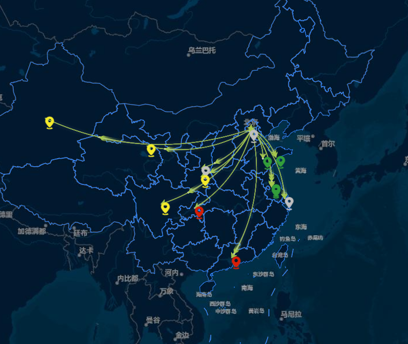

# leaflet实现叠加echart



:::success
有关将echart图叠加至leaflet地图上，我们需要使用一个插件leaflet-echarts。而且需要注意的是，如果我们使用leaflet叠加echart的话，目前来看，是指定echart的版本为4.2.0，这个版本的echarts中我们可以重写实例原型上的dataToPoint方法，这个方法就是将经纬度坐标转换为像素坐标的方法，具体如下：

:::

```tsx
 _initECharts: function () {
    const echarts = window.echarts;
    if (this._echart = echarts.init(this._echartsContainer),
      "3.0" <= echarts.version) {
      var me = this;
      console.log(echarts.version);
      // console.log('me._echart', echarts.version);
      //注册chinageojson
      // echarts.registerMap('china', chinageosjson);
      me._echart._geo.prototype.dataToPoint = function (lnglat) {
        //重写Echarts内部方法,Ecahrts内部有一套将经纬度转为像素坐标的方法，这里要换成与Leaflet相匹配的
        var latlng = new L.latLng(lnglat[1], lnglat[0])
          , pixel = me._map.latLngToContainerPoint(latlng);
        return [pixel.x, pixel.y];  //给定地理坐标，返回相对于地图container容器的相应像素坐标。
      }
    }
    this._unbindEvent();//屏蔽Echarts相关事件
  },
```

我们首先需要在index.html中引入echarts.js这个包，注意可能我们的项目中安装了其他更高版本的echarts，有的人可能图省事，直接在入口文件中这样写：（这样写就会导致一个后果）你后续在项目中使用的拳头是node_modules文件夹中的echarts，也就是通过npm或yarn安装的echarts，但是高版本的echarts实例没有 me._echart._geo.prototype.dataToPoint这个，导致叠加不上去。

```tsx
import * as echarts from 'echarts'
```

leaflet叠加echarts的必要条件：

+ 4.2.0版本的echart.js包
+ leaflet-echarts.js插件
+ index.html中引入echart.js包

完整示例：

```tsx
import React, { useEffect, useRef, useState } from "react";
import L from "leaflet";
import "leaflet/dist/leaflet.css";
import overlayEcharts from "@/scripts/libs/leaflet-echarts.js";
import chinageojson from "./chinamap";
import onlinePng from "./images/online.png";
import offlinePng from "./images/offline.png";
import alarmPng from "./images/alarm.png";
import initPng from "./images/init.png";
import "./index.scss";
/** 部分城市经纬度坐标点Map集 */
const geoCoordMap = {
  海门: [121.15, 31.89],
  鄂尔多斯: [109.781327, 39.608266],
  招远: [120.38, 37.35],
  舟山: [122.207216, 29.985295],
  齐齐哈尔: [123.97, 47.33],
  盐城: [120.13, 33.38],
  赤峰: [118.87, 42.28],
  青岛: [120.33, 36.07],
  乳山: [121.52, 36.89],
  金昌: [102.188043, 38.520089],
  泉州: [118.58, 24.93],
  莱西: [120.53, 36.86],
  日照: [119.46, 35.42],
  胶南: [119.97, 35.88],
  南通: [121.05, 32.08],
  拉萨: [91.11, 29.97],
  云浮: [112.02, 22.93],
  梅州: [116.1, 24.55],
  文登: [122.05, 37.2],
  上海: [121.48, 31.22],
  攀枝花: [101.718637, 26.582347],
  威海: [122.1, 37.5],
  承德: [117.93, 40.97],
  厦门: [118.1, 24.46],
  汕尾: [115.375279, 22.786211],
  潮州: [116.63, 23.68],
  丹东: [124.37, 40.13],
  太仓: [121.1, 31.45],
  曲靖: [103.79, 25.51],
  烟台: [121.39, 37.52],
  福州: [119.3, 26.08],
  瓦房店: [121.979603, 39.627114],
  即墨: [120.45, 36.38],
  抚顺: [123.97, 41.97],
  玉溪: [102.52, 24.35],
  张家口: [114.87, 40.82],
  阳泉: [113.57, 37.85],
  莱州: [119.942327, 37.177017],
  湖州: [120.1, 30.86],
  汕头: [116.69, 23.39],
  昆山: [120.95, 31.39],
  宁波: [121.56, 29.86],
  湛江: [110.359377, 21.270708],
  揭阳: [116.35, 23.55],
  荣成: [122.41, 37.16],
  连云港: [119.16, 34.59],
  葫芦岛: [120.836932, 40.711052],
  常熟: [120.74, 31.64],
  东莞: [113.75, 23.04],
  河源: [114.68, 23.73],
  淮安: [119.15, 33.5],
  泰州: [119.9, 32.49],
  南宁: [108.33, 22.84],
  营口: [122.18, 40.65],
  惠州: [114.4, 23.09],
  江阴: [120.26, 31.91],
  蓬莱: [120.75, 37.8],
  韶关: [113.62, 24.84],
  嘉峪关: [98.289152, 39.77313],
  广州: [113.23, 23.16],
  延安: [109.47, 36.6],
  太原: [112.53, 37.87],
  清远: [113.01, 23.7],
  中山: [113.38, 22.52],
  昆明: [102.73, 25.04],
  寿光: [118.73, 36.86],
  盘锦: [122.070714, 41.119997],
  长治: [113.08, 36.18],
  深圳: [114.07, 22.62],
  珠海: [113.52, 22.3],
  宿迁: [118.3, 33.96],
  咸阳: [108.72, 34.36],
  铜川: [109.11, 35.09],
  平度: [119.97, 36.77],
  佛山: [113.11, 23.05],
  海口: [110.35, 20.02],
  江门: [113.06, 22.61],
  章丘: [117.53, 36.72],
  肇庆: [112.44, 23.05],
  大连: [121.62, 38.92],
  临汾: [111.5, 36.08],
  吴江: [120.63, 31.16],
  石嘴山: [106.39, 39.04],
  沈阳: [123.38, 41.8],
  苏州: [120.62, 31.32],
  茂名: [110.88, 21.68],
  嘉兴: [120.76, 30.77],
  长春: [125.35, 43.88],
  胶州: [120.03336, 36.264622],
  银川: [106.27, 38.47],
  张家港: [120.555821, 31.875428],
  三门峡: [111.19, 34.76],
  锦州: [121.15, 41.13],
  南昌: [115.89, 28.68],
  柳州: [109.4, 24.33],
  三亚: [109.511909, 18.252847],
  自贡: [104.778442, 29.33903],
  吉林: [126.57, 43.87],
  阳江: [111.95, 21.85],
  泸州: [105.39, 28.91],
  西宁: [101.74, 36.56],
  宜宾: [104.56, 29.77],
  呼和浩特: [111.65, 40.82],
  成都: [104.06, 30.67],
  大同: [113.3, 40.12],
  镇江: [119.44, 32.2],
  桂林: [110.28, 25.29],
  张家界: [110.479191, 29.117096],
  宜兴: [119.82, 31.36],
  北海: [109.12, 21.49],
  西安: [108.95, 34.27],
  金坛: [119.56, 31.74],
  东营: [118.49, 37.46],
  牡丹江: [129.58, 44.6],
  遵义: [106.9, 27.7],
  绍兴: [120.58, 30.01],
  扬州: [119.42, 32.39],
  常州: [119.95, 31.79],
  潍坊: [119.1, 36.62],
  重庆: [106.54, 29.59],
  台州: [121.420757, 28.656386],
  南京: [118.78, 32.04],
  滨州: [118.03, 37.36],
  贵阳: [106.71, 26.57],
  无锡: [120.29, 31.59],
  本溪: [123.73, 41.3],
  克拉玛依: [84.77, 45.59],
  渭南: [109.5, 34.52],
  马鞍山: [118.48, 31.56],
  宝鸡: [107.15, 34.38],
  焦作: [113.21, 35.24],
  句容: [119.16, 31.95],
  北京: [116.46, 39.92],
  徐州: [117.2, 34.26],
  衡水: [115.72, 37.72],
  包头: [110, 40.58],
  绵阳: [104.73, 31.48],
  乌鲁木齐: [87.68, 43.77],
  枣庄: [117.57, 34.86],
  杭州: [120.19, 30.26],
  淄博: [118.05, 36.78],
  鞍山: [122.85, 41.12],
  溧阳: [119.48, 31.43],
  库尔勒: [86.06, 41.68],
  安阳: [114.35, 36.1],
  开封: [114.35, 34.79],
  济南: [117, 36.65],
  德阳: [104.37, 31.13],
  温州: [120.65, 28.01],
  九江: [115.97, 29.71],
  邯郸: [114.47, 36.6],
  临安: [119.72, 30.23],
  兰州: [103.73, 36.03],
  沧州: [116.83, 38.33],
  临沂: [118.35, 35.05],
  南充: [106.110698, 30.837793],
  天津: [117.2, 39.13],
  富阳: [119.95, 30.07],
  泰安: [117.13, 36.18],
  诸暨: [120.23, 29.71],
  郑州: [113.65, 34.76],
  哈尔滨: [126.63, 45.75],
  聊城: [115.97, 36.45],
  芜湖: [118.38, 31.33],
  唐山: [118.02, 39.63],
  平顶山: [113.29, 33.75],
  邢台: [114.48, 37.05],
  德州: [116.29, 37.45],
  济宁: [116.59, 35.38],
  荆州: [112.239741, 30.335165],
  宜昌: [111.3, 30.7],
  义乌: [120.06, 29.32],
  丽水: [119.92, 28.45],
  洛阳: [112.44, 34.7],
  秦皇岛: [119.57, 39.95],
  株洲: [113.16, 27.83],
  石家庄: [114.48, 38.03],
  莱芜: [117.67, 36.19],
  常德: [111.69, 29.05],
  保定: [115.48, 38.85],
  湘潭: [112.91, 27.87],
  金华: [119.64, 29.12],
  岳阳: [113.09, 29.37],
  长沙: [113, 28.21],
  衢州: [118.88, 28.97],
  廊坊: [116.7, 39.53],
  菏泽: [115.480656, 35.23375],
  合肥: [117.27, 31.86],
  武汉: [114.31, 30.52],
  大庆: [125.03, 46.58],
};
// 归一化处理
function normalization(distribution, max, min) {
  let normalizationRatio = (distribution - min) / (max - min);
  return normalizationRatio;
}
/** 热传递地图效果 */
function HeatMigration() {
  const [heatData, setHeatData] = useState(); // 各原始卫星数据接收节点数据信息
  const [nodeData, setNodeData] = useState(); // 各节点接收数据状态信息
  useEffect(() => {
    const type = 0; // 0：原始数据，1：产品数据
    let dataOne = [
      {
        name: "重庆遥感应用基地",
        amount: "5822",
        coord: '{"type":"Point","coordinates":[107.8744474,30.0571764]}',
        size: "13466170983889",
        sname: "重庆遥感应用基地",
      },
      {
        name: "济南遥感应用基地",
        amount: "4443",
        coord: '{"type":"Point","coordinates":[118.1547273,36.3537693]}',
        size: "14594231431574",
        sname: "济南遥感应用基地",
      },
      {
        name: "上海遥感应用基地",
        amount: "3369",
        coord: '{"type":"Point","coordinates":[121.4630237,31.239162]}',
        size: "4562038334055",
        sname: "上海遥感应用基地",
      },
      {
        name: "广东遥感应用基地",
        amount: "2521",
        coord: '{"type":"Point","coordinates":[113.4238977,23.3432286]}',
        size: "7997490644187",
        sname: "广东遥感应用基地",
      },
      {
        name: "青岛遥感应用基地",
        amount: "1431",
        coord: '{"type":"Point","coordinates":[120.1425155,36.4546725]}',
        size: "3162118709294",
        sname: "青岛遥感应用基地",
      },
      {
        name: "扬州遥感应用基地",
        amount: "757",
        coord: '{"type":"Point","coordinates":[119.4745363,32.7369834]}',
        size: "1131229849239",
        sname: "扬州遥感应用基地",
      },
      {
        name: "苏州市中科天启",
        amount: "565",
        coord: '{"type":"Point","coordinates":[119.4668586,32.9649819]}',
        size: "804245503265",
        sname: "苏州市中科天启",
      },
      {
        name: "西安遥感应用基地",
        amount: "164",
        coord: '{"type":"Point","coordinates":[108.7916861,34.1071283]}',
        size: "319966770648",
        sname: "西安遥感应用基地",
      },
      {
        name: "甘肃遥感应用基地",
        amount: "139",
        coord: '{"type":"Point","coordinates":[100.6038782,37.8816317]}',
        size: "58652736369",
        sname: "甘肃遥感应用基地",
      },
      {
        name: "河北遥感应用基地",
        amount: "46",
        coord: '{"type":"Point","coordinates":[116.1333487,39.5487542]}',
        size: "30322510226",
        sname: "河北遥感应用基地",
      },
      {
        name: "陕西遥感应用基地",
        amount: "3",
        coord: '{"type":"Point","coordinates":[108.8687363,35.1916226]}',
        size: "526926998",
        sname: "陕西遥感应用基地",
      },
      {
        name: "四川遥感应用基地",
        amount: "1",
        coord: '{"type":"Point","coordinates":[102.6929576,30.6292543]}',
        size: "338696041",
        sname: "四川遥感应用基地",
      },
      {
        name: "新疆遥感应用基地",
        amount: "1",
        coord: '{"type":"Point","coordinates":[85.1910816,41.1163261]}',
        size: "2999635207",
        sname: "新疆遥感应用基地",
      },
    ];
    setHeatData(dataOne); /** 获取一体机节点数据接收的状态回传信息 */
    let dataTwo = [
      {
        id: "1800732708816768",
        uid: "1695875295901376",
        orgName: "河北遥感应用基地",
        orgNameId: "130033",
        errorMsg: "",
        ip: "10.255.12.207",
        lastUpdateTime: "2024-10-11 07:39:21",
        errorCount: 0,
        totalStorage: "10995097399296",
        freeStorage: "10950916788224",
        offline: 1,
      },
      {
        id: "1732035642898240",
        uid: "1695886481319616",
        orgName: "陕西遥感应用基地",
        orgNameId: "130090",
        errorMsg: "",
        ip: "10.240.160.30",
        lastUpdateTime: "2024-03-29 15:01:58",
        errorCount: 0,
        totalStorage: "804425560064",
        freeStorage: "233847312384",
        offline: 1,
      },
      {
        id: "1751067221673536",
        uid: "1750721687766592",
        orgName: "上海遥感应用基地",
        orgNameId: "130379",
        errorMsg: "",
        ip: "192.168.12.15",
        lastUpdateTime: "2025-07-22 17:10:24",
        errorCount: 0,
        totalStorage: "109951162777600",
        freeStorage: "105380754685952",
        offline: 0,
      },
      {
        id: "1731376456926720",
        uid: "1657638674529984",
        orgName: "重庆遥感应用基地",
        orgNameId: "130233",
        errorMsg: "下载中断",
        ip: "10.120.47.10",
        lastUpdateTime: "2025-07-22 17:10:00",
        errorCount: 4,
        totalStorage: "7681365504000",
        freeStorage: "6868528209920",
        offline: 0,
      },
      {
        id: "1763169122219712",
        uid: "1695882564294336",
        orgName: "济南遥感应用基地",
        orgNameId: "130065",
        errorMsg: "",
        ip: "172.16.1.56",
        lastUpdateTime: "2025-07-22 17:10:52",
        errorCount: 0,
        totalStorage: "16000881782784",
        freeStorage: "3237275451392",
        offline: 0,
      },
      {
        id: "1735230507902528",
        uid: "1693741853677312",
        orgName: "扬州遥感应用基地",
        orgNameId: "130013",
        errorMsg: "",
        ip: "10.0.0.102",
        lastUpdateTime: "2025-07-22 17:10:18",
        errorCount: 0,
        totalStorage: "102554136444928",
        freeStorage: "87043586785280",
        offline: 0,
      },
      {
        id: "1732128717395904",
        uid: "1695883883939520",
        orgName: "广东遥感应用基地",
        orgNameId: "130073",
        errorMsg: "",
        ip: "172.20.105.102",
        lastUpdateTime: "2025-07-22 17:10:02",
        errorCount: 0,
        totalStorage: "8795956703232",
        freeStorage: "642540724224",
        offline: 0,
      },
      {
        id: "1731358881506816",
        uid: "1655247694603904",
        orgName: "苏州市中科天启",
        orgNameId: "11771",
        errorMsg: "",
        ip: "10.16.20.49",
        lastUpdateTime: "2025-07-22 17:10:38",
        errorCount: 0,
        totalStorage: "19996304474112",
        freeStorage: "5168185626624",
        offline: 0,
      },
      {
        id: "1802466444621696",
        uid: "1695882806703808",
        orgName: "青岛遥感应用基地",
        orgNameId: "130067",
        errorMsg: "",
        ip: "192.168.1.9",
        lastUpdateTime: "2025-07-22 17:10:09",
        errorCount: 0,
        totalStorage: "16000764342272",
        freeStorage: "2666385481728",
        offline: 0,
      },
    ];
    setNodeData(dataTwo);
  }, []);
  useEffect(() => {
    const map = initMap();
    if (heatData && heatData.length) {
      /** 定制收集北京到各个接收数据基地位置的连接点数组 */
      let BJData = [];
      heatData.forEach((item, index) => {
        if (item.coord) {
          let cordjson = JSON.parse(item.coord);
          let coordinates = cordjson.coordinates; /** 连线的点 */
          BJData.push([
            { name: "北京" },
            {
              name: item.sname,
              value: item.amount,
              size: item.size,
              coord: coordinates,
            },
          ]);
        }
      }); /** 连接线 */
      const series = buildSeries(BJData);
      let echartsOptions = buildEchartsOptions(series); //将Echarts加到地图上
      overlayEcharts(echartsOptions).addTo(map);
      [["北京", BJData]].forEach(function (item, i) {
        let nodeItem = item[1].map((dataItem) => {
          /** 如果后台接口返回的节点名称不包含坐标点就去城市坐标点Map中匹配 */
          return (geoCoordMap[dataItem[1].name] ?? dataItem[1].coord)
            .concat([dataItem[1].value])
            .concat([dataItem[1].size])
            .concat([dataItem[1].name]);
        });
        buildMarker(nodeItem, map);
      });
    }
    return () => {
      map.off();
      map.remove();
    };
  }, [nodeData]); /** 基于单个节点的坐标、名称等构建点注记 */
  const buildMarker = (nodeItem, map) => {
    nodeItem.map((item) => {
      let nodeName = item[4];
      let nodeStatusData;
      if (nodeData) {
        /** 从节点数据接收状态数据中匹配对应的节点状态数据（状态是通过数据接收终端工具回传给服务端的） */
        nodeStatusData = nodeData.filter((item) => {
          return nodeName == item.orgName;
        });
      }
      /** 注记的icon对应的样式类名称  */
      let className = "";
      /** 注记绑定的弹窗html内容 */
      let htmlContent = "";
      /** 剩余容量低于这个值告警 */
      const thresholdValue = 10;
      let titleIcon = "";
      if (!nodeStatusData || nodeStatusData.length == 0) {
        /** 如果当前的节点不存在任何状态数据，那就是初始态 */
        className = "position_init";
        titleIcon = ``;
        htmlContent = `
        <div class="heat-label">
        <div>${titleIcon} <span style="vertical-align: middle;">${item[4]}</span> </div>
        </div>`;
      } else {
        let statusInfo = nodeStatusData[0];
        const {
          errorCount,
          errorMsg,
          totalStorage,
          freeStorage,
          ip,
          lastUpdateTime,
          offline,
          orgName,
        } = statusInfo;
        let percent = ((freeStorage / totalStorage) * 100).toFixed(0);
        if (offline == 1) {
          className = "position_offline";
          titleIcon = ``;
        } else {
          if (percent < thresholdValue) {
            className = "position_alarm";
            titleIcon = ``;
          } else if (errorCount > 0) {
            className = "position_alarm";
            titleIcon = ``;
          } else {
            className = "position_normal";
            titleIcon = ``;
          }
        }
        const storageColor = percent < thresholdValue ? "#D81E06" : "#26a0da";
        const errDiv =
          errorCount == 0
            ? `<div class="storage-container">
                <span class="title-text" >数据异常信息：</span><span>无</span>
              </div>`
            : `<div class="storage-container">
                <span class="title-text" >数据异常信息：</span>
                <span>共有<span style="color:red">${errorCount}</span>景数据接收异常 </span></div>
              <div>数据异常原因：${errorMsg}</div>
        `;
        //  htmlContent = `
        //   <div class="heat-label">
        //       <div>${titleIcon} <span style="vertical-align: middle;">${orgName}</span> </div>
        //       <hr/>
        //       <div class="heat-label-content">
        //         <div class="storage-container">
        //            
        //            <div class="storage-container-content">
        //               <div>数据接收盘:</div>
        //               <div style="
        //               height:20px;
        //               background-image: linear-gradient(
        //                   to right,
        //                   ${storageColor} 0%,
        //                   ${storageColor} ${100-percent}%,
        //                   rgb(230,230,230) ${100-percent}%,
        //                   rgb(230,230,230) 100%
        //                 );
        //               "></div>
        //               <div>${util.bytesToSize(freeStorage)}可用，共${util.bytesToSize(totalStorage)}</div>
        //             </div>
        //         </div>
        //         <div>IPV4地址：${ip}</div>
        //         ${errDiv}
        //         <div>最近活跃时间：${lastUpdateTime}</div>
        //       </div>
        //   </div>`;

        htmlContent = `
          <div class="heat-label">
            <div>${titleIcon} <span style="vertical-align: middle;">${orgName}</span> </div>
            <hr/>
            <div class="heat-label-content">
              <div class="storage-container">
                <span class="title-text" >数据接收盘：</span>
              </div>
              <div class="storage-container">
                <span class="title-text" >IPV4地址：</span>
                <span>${ip}</span>
              </div>
              ${errDiv}
              <div class="storage-container">
                <span class="title-text" >最近活跃时间：</span>
                <span>${lastUpdateTime}</span>
              </div>
            </div>
          </div>`;
      }

      let ball = L.divIcon({
        html: `<div class=${className}></div>`,
        className: "custom-marker-ball",
      });
      let ballMarker = L.marker([item[1], item[0]], {
        icon: ball,
        zIndexOffset: -100, // 防止标签与图标相互遮挡
      })
        .bindPopup(htmlContent)
        .openPopup()
        .addTo(map);
      ballMarker.on("mouseover", function (event) {
        ballMarker.openPopup();
      });
    });
  };
  const buildEchartsOptions = (series) => {
    return {
      tooltip: {
        trigger: "item",
        formatter: "{b}",
      },
      geo: {
        roam: true, // 是否开启放大缩小/拖拽功能
        label: {
          emphasis: {
            show: false,
          },
        },
        itemStyle: {
          normal: {
            areaColor: "#323c48",
            borderColor: "#111",
          },
          emphasis: {
            areaColor: "#2a333d",
          },
        },
      },
      series: series,
    };
  }; /** 构建迁徙图连接线数据集 */
  const buildSeries = (pointData) => {
    let series = [];
    /**
     * #a6c84c ：青色
     * #ffa022 : 橙色
     * #46bee9 : 天蓝
     */
    const color = ["#a6c84c", "#ffa022", "#46bee9"];
    [["北京", pointData]].forEach(function (item, i) {
      series.push(
        {
          name: item[0] + " Top10",
          type: "lines",
          coordinateSystem: "geo",
          zlevel: 1,
          effect: {
            show: true,
            period: 6,
            trailLength: 0.7,
            color: "#fff",
            symbolSize: 3,
          },
          lineStyle: {
            normal: {
              color: color[i],
              width: 0,
              curveness: 0.2,
            },
          },
          data: convertData(item[1]),
        },
        {
          name: item[0] + " Top10",
          type: "lines",
          coordinateSystem: "geo",
          zlevel: 2,
          symbol: ["none", "arrow"],
          symbolSize: 10,
          effect: {
            show: true,
            period: 6,
            trailLength: 0.2,
            symbol: "arrow", //箭头图标
            symbolSize: 8,
          },
          lineStyle: {
            normal: {
              color: color[i],
              width: 1,
              opacity: 0.6,
              curveness: 0.2,
            },
          },
          data: convertData(item[1]),
        }
      );
    });
    return series;
  }; /** 节点数据转连线数据集 */
  const convertData = (data) => {
    let res = [];
    for (let i = 0; i < data.length; i++) {
      let dataItem = data[i];
      let fromCoord = geoCoordMap[dataItem[0].name];
      let toCoord = geoCoordMap[dataItem[1].name] ?? dataItem[1].coord;
      if (fromCoord && toCoord) {
        res.push({
          fromName: dataItem[0].name,
          toName: dataItem[1].name,
          coords: [fromCoord, toCoord],
          value: dataItem[1].value,
        });
      }
    }
    return res;
  }; /** 初始化地图（栅格底图图层 + 行政区划geojson图层） */
  const initMap = () => {
    const map = L.map("map", {
      center: [35.29, 102.65],
      attributionControl: false,
      zoomControl: false,
      minZoom: 3, // maxZoom: 4,
      zoomSnap: 0.2,
      zoom: 4.2, // dragging: false,
    });
    L.tileLayer("http://10.17.17.243/tdtzj/{z}/{y}/{x}.png", {}).addTo(map);
    L.geoJSON(chinageojson, {
      style: function (feature) {
        return { weight: 1, fillOpacity: 0 };
      },
    })
      .setZIndex(1)
      .addTo(map);
    return map;
  };
  return (
    <div
      style={{
        position: "relative",
        height: "calc(100vh - 84px)",
        width: "100%",
      }}
    >
      <div id="map" style={{ height: "100%", widthL: "100%" }} />
    </div>
  );
}
export default HeatMigration;

```

```tsx
.leaflet-marker-icon {
    display: flex;
    justify-content: center;
    align-items: center;
    width: 30px !important;
    height: 30px !important;
    .position_init{
      width: 30px;
      height: 30px;
      background: url(./images/position_init.png) center no-repeat;
      background-size: 100% 100%;
    }
    .position_normal{
      width: 30px;
      height: 30px;
      background: url(./images/position_normal.png) center no-repeat;
      background-size: 100% 100%;
    }
    .position_offline{
      width: 30px;
      height: 30px;
      background: url(./images/position_offline.png) center no-repeat;
      background-size: 100% 100%;
    }
    .position_alarm{
      width: 30px;
      height: 30px;
      background: url(./images/position_alarm.png) center no-repeat;
      background-size: 100% 100%;
    }
  
  }
  .leaflet-popup-pane {
    .leaflet-popup {
      .leaflet-popup-content-wrapper {
        background: rgb(9 61 89 / 80%);
        .heat-label {
          width: 100%;
          height: 100%;
          font-size: 1.2rem;
          font-weight: bold;
          color: #fff;
          text-align: left;
          .heat-label-content{
            font-size: 18px;
          }
        }
      }
      .leaflet-popup-tip-container {
        /**小箭头的样式*/
        .leaflet-popup-tip {
          background: #6d96ac30;
        }
      }
    }
  }
  
  .storage-container{
    display: flex;
    align-items: center;
    font-size: 16px;
    // font-weight: normal;
    .title-text {
      font-size: 18px;
      font-weight: bold;
    }
  }
  .storage-container-icon{
    width: 32px;
    border: none;
    margin-right: 5px;
  }
  .storage-container-content{
    height: 64px;
    display: flex;
    justify-content: center;
    flex-direction: column;
  }
```


> 更新: 2025-07-23 11:58:47  
> 原文: <https://www.yuque.com/quwaidi-exykz/lv0i4k/gw6lhbmzqzddf9eg>