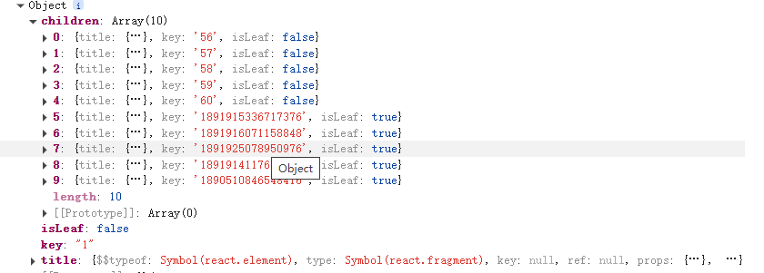

# 构造递归的树形结构（使用了递归的思想）

 

:::warning

所以一个节点下的孩子都是放在children中，我们就需要对接口获取的数据进行处理，将接口获取的数据里面的children和relatedObjs这个都放到children里面

:::

1.从接口中获取原始的树形数据，一般是这样的：

2.基于接口数据构建递归的树形结构，包括节点样式编写等：
<pre data-language="tsx" id="HGQer" class="ne-codeblock language-tsx"><code>  const loop = (node: any, isSearch?: boolean): DataNode =&gt; {
    if (!node || !node.name) {
      return {
        title: &quot;&quot;,
        key: node?.id || &quot;&quot;,
        isLeaf: true,
      };
    }
    // 获取当前节点的数据
    const strTitle = node.name;
    const index = searchValue ? strTitle.indexOf(searchValue) : -1;
    const beforeStr = index &gt; -1 ? strTitle.substring(0, index) : strTitle;
    const afterStr =
      index &gt; -1 ? strTitle.slice(index + searchValue.length) : &quot;&quot;;
    // 判断是否为目录节点 - 只检查 children
    const isDirectory = node.children;
    // 构建下拉菜单按钮
    const same = (
      &lt;&gt;
        &lt;Dropdown
          menu={{
            items: renderMoreitems(
              node.id.toString(),
              isDirectory,
              node,
              isSearch
            ),
          }}
          trigger={[&quot;click&quot;]}
        &gt;
          &lt;Button
            type=&quot;text&quot;
            size=&quot;small&quot;
            icon={&lt;IconFont type=&quot;icon-gengduo&quot; className=&quot;node-more-icon&quot; /&gt;}
            onClick={(e) =&gt; {
              e.stopPropagation();
              e.preventDefault();
              setLeft();
              setSelectedID(node.id.toString());
              setSelectedNode(node);
              if (node?.obj) {
                setObjid(node.obj.id);
              }
              // 如果有任务ID则设置，否则获取任务列表
              if (node.obj?.id) {
                setReftask(node.obj.id);
              } else {
                // 是叶子节点才会去获取任务列表
                if (!isDirectory) {
                  getTaskListByID(node.id);
                }
              }
              setSelectedKey(node.id);
            }}
          /&gt;
        &lt;/Dropdown&gt;
      &lt;/&gt;
    );
    // 构建标题部分
    let title =
      index &gt; -1 ? (
        &lt;&gt;
          &lt;Tooltip
            title={
              strTitle +
              `${
                !isDirectory
                  ? node?.obj?.style === 0
                    ? &quot;（瓦片集）&quot;
                    : &quot;（任务集）&quot;
                  : &quot;&quot;
              }`
            }
          &gt;
            &lt;span
              className=&quot;node-title&quot;
              onClick={() =&gt; {
                visionmanage(
                  node.id.toString(),
                  node,
                  node.obj?.refDataSet || node.obj?.id,
                  node?.obj?.refTask
                );
              }}
            &gt;
              {isDirectory ? (
                &lt;IconFont type=&quot;icon-wenjianjia&quot; className=&quot;node-title-icon&quot; /&gt;
              ) : node.obj.style === 0 ? (
                &lt;IconFont type=&quot;icon-wenjian&quot; className=&quot;node-title-icon&quot; /&gt;
              ) : (
                &lt;IconFont
                  type=&quot;icon-tubiaozhizuomoban&quot;
                  className=&quot;node-title-icon&quot;
                /&gt;
              )}
              {beforeStr}
              &lt;span className=&quot;site-tree-search-value&quot;&gt;{searchValue}&lt;/span&gt;
              {afterStr}
            &lt;/span&gt;
          &lt;/Tooltip&gt;
          &lt;span className=&quot;node-publish-wrap&quot;&gt;
            {node?.obj?.bPublish &amp;&amp; (
              &lt;Tooltip title=&quot;已发布&quot;&gt;
                &lt;IconFont className=&quot;publishicon&quot; type=&quot;icon-wei-&quot; /&gt;
              &lt;/Tooltip&gt;
            )}
          &lt;/span&gt;
          &lt;div&gt;{same}&lt;/div&gt;
        &lt;/&gt;
      ) : (
        &lt;&gt;
          &lt;Tooltip
            title={
              strTitle +
              `${
                !isDirectory
                  ? node?.obj?.style === 0
                    ? &quot;（瓦片集）&quot;
                    : &quot;（任务集）&quot;
                  : &quot;&quot;
              }`
            }
          &gt;
            &lt;span
              className=&quot;node-title&quot;
              onClick={() =&gt; {
                visionmanage(
                  node.id.toString(),
                  node,
                  node.obj?.refDataSet || node.obj?.id,
                  node?.obj?.refTask
                );
              }}
            &gt;
              {isDirectory ? (
                &lt;IconFont type=&quot;icon-wenjianjia&quot; className=&quot;node-title-icon&quot; /&gt;
              ) : node.obj.style === 0 ? (
                &lt;IconFont type=&quot;icon-wenjian&quot; className=&quot;node-title-icon&quot; /&gt;
              ) : (
                &lt;IconFont
                  type=&quot;icon-tubiaozhizuomoban&quot;
                  className=&quot;node-title-icon&quot;
                /&gt;
              )}
              {strTitle}
            &lt;/span&gt;
          &lt;/Tooltip&gt;
          &lt;span className=&quot;node-publish-wrap&quot;&gt;
            {node?.obj?.bPublish &amp;&amp; (
              &lt;Tooltip title=&quot;已发布&quot;&gt;
                &lt;IconFont className=&quot;publishicon&quot; type=&quot;icon-wei-&quot; /&gt;
              &lt;/Tooltip&gt;
            )}
          &lt;/span&gt;
          &lt;div&gt;{same}&lt;/div&gt;
        &lt;/&gt;
      );
    // 构建返回的节点数据
    const nodeData: DataNode = {
      title,
      key: node.id,
      isLeaf: !isDirectory,
    };
    // 处理子节点
    const childNodes: any[] = [];
    if (node.children &amp;&amp; node.children.length &gt; 0) {
      childNodes.push(...node.children);
    }
    if (node.relatedObjs &amp;&amp; node.relatedObjs.length &gt; 0) {
      childNodes.push(...node.relatedObjs);
    }
    // 如果有子节点，递归处理
    if (childNodes.length &gt; 0) {
      // 将节点分为目录和叶子节点
      const folderNodes = childNodes.filter((child) =&gt; child.children);
      const leafNodes = childNodes.filter((child) =&gt; !child.children);
      // 对目录和叶子节点分别进行排序
      folderNodes.sort((a, b) =&gt; (a.sequence || 0) - (b.sequence || 0));
      leafNodes.sort((a, b) =&gt; (a.sequence || 0) - (b.sequence || 0));
      // 先放置目录，再放置叶子节点
      nodeData.children = [
        ...folderNodes.map((child) =&gt; loop(child, undefined)),
        ...leafNodes.map((child) =&gt; loop(child, undefined)),
      ];
    }
    return nodeData;
  };</code></pre>

3.树形结构是可以异步展开的，所以需要配置一下：
<pre data-language="tsx" id="ZiODL" class="ne-codeblock language-tsx"><code>  const onLoadData = async (treeNode: DataNode) =&gt; {
    // 获取当前节点的key
    const nodeKey = treeNode.key;
    try {
      // 如果是根节点，直接返回
      if (nodeKey === &quot;1&quot;) return;
      // 获取当前节点的数据
      const currentNode = findNodeByKey(isNotHandleData, nodeKey as any);
      if (!currentNode) return;
      // 发起请求获取子节点数据
      const response = await OneMapService.queryFoldById(nodeKey as string);
      // 使用 Set 去重
      setLoadKeys(Array.from(new Set([...loadKeys, nodeKey])));
      setExpandedKeys(Array.from(new Set([...expandedKeys, nodeKey])));
      if (response.data) {
        // 更新节点数据
        const updatedNode = {
          ...currentNode,
          children: response.data.children || [],
          relatedObjs: response.data.relatedObjs || [],
        };
        // 更新整个树数据
        const newTreeData = updateNodeInTree(
          isNotHandleData,
          nodeKey as any,
          updatedNode
        );
        setIsNotHandleData(newTreeData);
      }
    } catch (error) {
      console.error(&quot;加载节点数据失败:&quot;, error);
      message.error(&quot;加载节点数据失败&quot;);
    }
  };</code></pre>

4.更新树形结构，这个是一个纯函数：（这个主要是替换树中的要更新的节点来实现的）
<pre data-language="tsx" id="cznLP" class="ne-codeblock language-tsx"><code>const updateNodeInTree = (
  tree: any,
  key: string | number,
  updatedNode: any,
  isPublish?: boolean
): any =&gt; {
  if (!tree) return null;
  // 如果是目标节点，直接返回更新后的节点
  if (tree.id === key) {
    if (isPublish) {
    } else {
      return updatedNode;
    }
  }
  // 创建新的树对象
  const newTree = { ...tree };
  // 处理 children
  if (tree.children) {
    newTree.children = tree.children.map((child: any) =&gt;
      updateNodeInTree(child, key, updatedNode)
    );
  }
  if (tree.relatedObjs) {
    newTree.relatedObjs = tree.relatedObjs.map((obj: any) =&gt;
      updateNodeInTree(obj, key, updatedNode)
    );
  }
  return newTree;
};</code></pre>

5.删除节点：
<pre data-language="typescript" id="XBdLw" class="ne-codeblock language-typescript"><code>const deleteNodeFromTree = (tree: any, key: string | number): any =&gt; {
  if (!tree) return null;
  // 创建新的树对象
  const newTree = { ...tree };
  // 处理 children
  if (tree.children) {
    // 递归删除 children 中的节点
    newTree.children = tree.children
      .map((child: any) =&gt; {
        // 如果当前节点是要删除的节点，返回 null
        if (child.id === key) {
          return null;
        }
        // 否则递归处理子节点
        return deleteNodeFromTree(child, key);
      })
      .filter((child: any) =&gt; child !== null);
  }
  // 处理 relatedObjs
  if (tree.relatedObjs) {
    // 递归删除 relatedObjs 中的节点
    newTree.relatedObjs = tree.relatedObjs
      .map((obj: any) =&gt; {
        // 如果当前节点是要删除的节点，返回 null
        if (obj.id === key) {
          return null;
        }
        // 否则递归处理子节点
        return deleteNodeFromTree(obj, key);
      })
      .filter((obj: any) =&gt; obj !== null);
  }
  return newTree;
};</code></pre>

> 更新: 2025-06-30 08:22:51  
> 原文: <https://www.yuque.com/quwaidi-exykz/lv0i4k/cv73hx8g64a7hz3z>